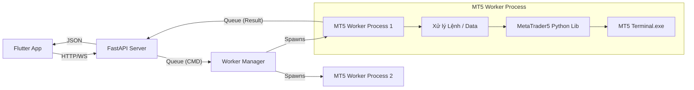

# Tài liệu Workflow và Tính năng Dự án Trade App

Tài liệu này mô tả chi tiết luồng hoạt động (workflow) và các tính năng của ứng dụng giao dịch **ATrade-Connect**.

## 1. Tổng quan Sơ đồ Workflow (User Flow)

Dưới đây là sơ đồ luồng người dùng chính trong ứng dụng:

```mermaid
graph TD
    Start([Khởi động App]) --> CheckLogin{Đã đăng nhập?}
    
    %% Luồng Đăng nhập
    CheckLogin -- Không --> LoginScreen[Màn hình Đăng nhập]
    LoginScreen --> Input[Nhập Login, Pass, Server]
    LoginScreen --> SavedAcc[Chọn Tài khoản đã lưu]
    Input --> API_Login[POST /login]
    SavedAcc --> API_Login
    API_Login -- Thành công --> SavePref[Lưu SharedPreferences]
    SavePref --> MainScreen
    
    %% Màn hình Chính
    CheckLogin -- Có --> MainScreen[Màn hình Chính \n(Bottom Navigation)]
    
    %% Các Tab Chính
    MainScreen --> Tab_Quotes[Tab Báo giá\n(Quotes)]
    MainScreen --> Tab_Chart[Tab Biểu đồ\n(Chart)]
    MainScreen --> Tab_Trade[Tab Giao dịch\n(Trade)]
    MainScreen --> Tab_History[Tab Lịch sử\n(History)]
    MainScreen --> Tab_Wallet[Tab Ví\n(Wallet)]
    
    %% Chi tiết Quotes
    Tab_Quotes --> WS_Quotes[WebSocket: Nhận giá Bid/Ask]
    WS_Quotes --> UpdateUI_Quotes[Cập nhật UI & Hiệu ứng nháy màu]
    
    %% Chi tiết Chart
    Tab_Chart --> Chart_Actions{Hành động}
    Chart_Actions -- Xem --> LoadCandles[API: Lấy nến lịch sử]
    Chart_Actions -- Đổi Symbol --> LoadCandles
    Chart_Actions -- Trading --> OrderPanel[Panel Đặt lệnh]
    OrderPanel --> PlaceOrder[BUY / SELL / Limit]
    PlaceOrder --> API_Trade[POST /trade]
    Chart_Actions -- Kéo thả SL/TP --> JS_Bridge[JS Bridge: PositionModified]
    JS_Bridge --> API_Modify[POST /modify]
    
    %% Chi tiết Trade
    Tab_Trade --> WS_Pos[WebSocket: Lấy Account/Positions]
    WS_Pos --> ShowStats[Hiển thị Balance, Equity, Margin]
    WS_Pos --> ListPos[Danh sách Lệnh đang chạy/Chờ]
    ListPos -- Giữ lì (Long Press) --> MenuOption[Menu Tùy chọn]
    MenuOption --> Action_Close[Đóng lệnh]
    MenuOption --> Action_Chart[Xem Biểu đồ]
    MenuOption --> Action_Bulk[Đóng hàng loạt]
    
    %% Chi tiết History
    Tab_History -- Mặc định --> ViewDeals[Xem danh sách Deals/Positions]
    Tab_History -- Filter --> FilterTools[Lọc theo Symbol / Ngày tháng]
    FilterTools --> API_History[POST /trade_history]
    
    %% Chi tiết Wallet
    Tab_Wallet --> ContactAdmin[Dialog: Liên hệ Admin Telegram]
```

---

## 2. Chi tiết từng Màn hình và Tính năng

### 2.1. Màn hình Đăng nhập (`LoginScreen`)
*   **Chức năng chính**: Xác thực người dùng và quản lý phiên đăng nhập.
*   **Các thành phần (Widgets)**:
    *   **Input Fields**: `Login ID`, `Password`, `Server`.
    *   **Button**: `Connect` (Kết nối). Gửi yêu cầu đăng nhập đến API backend.
    *   **List**: `Saved Accounts` (Danh sách tài khoản đã lưu). Cho phép chọn nhanh tài khoản cũ hoặc xóa tài khoản khỏi thiết bị.
*   **Xử lý Logic**:
    *   Khi đăng nhập thành công, thông tin tài khoản được lưu vào `SharedPreferences`.
    *   Tự động chuyển hướng vào `MainScreen`.
    *   Hỗ trợ "Auto Login" cho lần mở app tiếp theo.

### 2.2. Màn hình Báo giá (`QuotesScreen`)
*   **Chức năng chính**: Theo dõi biến động giá thị trường theo thời gian thực.
*   **Giao diện**:
    *   Danh sách các cặp tiền (EURUSD, XAUUSD, BTCUSD, v.v.).
    *   Hiển thị giá **Bid** và **Ask**.
    *   Chữ số cuối (pipetter) được hiển thị to hơn để dễ quan sát (Widget `_PriceBox`).
*   **Xử lý Logic**:
    *   Kết nối WebSocket (`/ws/quotes`) để nhận dữ liệu giá từng tick.
    *   **Hiệu ứng Flash**: So sánh giá mới với giá cũ. Nếu tăng -> Màu Xanh (Blue), Giảm -> Màu Đỏ (Red).
    *   Hiệu ứng biến mất sau 300ms.

### 2.3. Màn hình Biểu đồ (`ChartScreen`)
Đây là màn hình phức tạp nhất, tích hợp hiển thị và giao dịch.
*   **Khu vực Biểu đồ (WebView)**:
    *   Sử dụng thư viện biểu đồ (TradingView/Lightweight Charts) chạy trên nền HTML/JS assets.
    *   **Load History**: Gọi API lấy dữ liệu nến (OHLC) và vẽ lên biểu đồ.
    *   **Real-time Candle**: Nhận tick từ WebSocket và cập nhật nến hiện tại (Last Candle) trực tiếp bằng JavaScript (`window.updateLastCandle`).
    *   **Visual Trading**: Vẽ các đường lệnh (Position lines) lên biểu đồ. Hỗ trợ kéo thả đường SL/TP để sửa lệnh (Sự kiện `PositionModified` qua JavascriptChannel).
*   **Thanh Công cụ trên cùng (AppBar)**:
    *   Dropdown chọn **Symbol** (Cặp tiền).
    *   Dropdown chọn **Timeframe** (M1, M5, H1, D1...).
*   **Panel Đặt lệnh (Phía dưới)**:
    *   **Tab Market/Limit**: Chuyển đổi giữa lệnh thị trường và lệnh chờ.
    *   **Volume Control**: Nút +/- và ô nhập khối lượng (Lot size).
    *   **Trường SL/TP**: Nhập Stop Loss và Take Profit.
    *   **Nút BUY/SELL**: Nút lớn màu Xanh/Đỏ để vào lệnh ngay lập tức.
*   **Xử lý các trường hợp**:
    *   **Sửa lệnh**: Khi người dùng kéo đường SL/TP trên biểu đồ -> App gọi API `/modify`.
    *   **Đặt lệnh**: Gọi API `/trade`. Hệ thống tự tính toán giá nếu là lệnh Market.

### 2.4. Màn hình Quản lý Giao dịch (`TradeScreen`)
*   **Khu vực Thông tin Tài khoản (Header)**:
    *   Hiển thị: `Balance` (Số dư), `Equity` (Vốn), `Margin`, `Free Margin`, `Margin Level`.
    *   **Total Profit**: Tổng lợi nhuận hiện tại, đổi màu Xanh/Đỏ theo lãi/lỗ.
*   **Danh sách Lệnh**:
    *   **POSITIONS**: Các lệnh đang chạy (Open status).
    *   **ORDERS**: Các lệnh chờ (Pending status).
*   **Widget Thẻ lệnh (Card)**:
    *   Hiển thị Symbol, Loại (Buy/Sell), Volume.
    *   Hiển thị Lãi/Lỗ hiện tại (Real-time).
    *   Hiển thị giá mở cửa và giá hiện tại.
*   **Tương tác (Long Press Menu)**:
    *   Khi nhấn giữ vào một lệnh, menu tùy chọn hiện ra:
        1.  **Close Order**: Đóng lệnh đơn lẻ.
        2.  **Chart**: Chuyển sang màn hình Biểu đồ của cặp tiền đó.
        3.  **Close All [Symbol]**: Đóng tất cả các lệnh của cặp tiền đó (Bulk Close). Xử lý vòng lặp gọi API đóng từng lệnh.

### 2.5. Màn hình Lịch sử (`HistoryScreen`)
*   **Chức năng chính**: Báo cáo kết quả giao dịch.
*   **Tabs con**:
    *   `POSITIONS`: Lịch sử các lệnh đã đóng (tổng hợp entry/exit).
    *   `ORDERS`: Lịch sử đặt lệnh (bao gồm cả lệnh hủy).
    *   `DEALS`: Chi tiết từng transaction (khớp lệnh, swap, commission, nạp rút).
*   **Công cụ lọc (AppBar Actions)**:
    *   **Calendar**: Lọc theo ngày (Hôm nay, Tuần trước, Tùy chọn...).
    *   **Filter Symbol**: Lọc chỉ xem lịch sử của một mã nhất định.
*   **Thông tin Tổng hợp**:
    *   Hiển thị tổng Profit, Deposit, Swap, Commission trong giai đoạn được chọn.

### 2.6. Màn hình Ví (`WalletScreen`)
*   **Chức năng**: Giao diện Nạp/Rút tiền tượng trưng.
*   **Nút Deposit / Withdraw**:
    *   Hiện tại chưa tích hợp cổng thanh toán tự động.
    *   Hiển thị **Dialog** cung cấp thông tin liên hệ Admin (Telegram `@axtrade_admin`) để xử lý thủ công.

---

## 3. Kiến trúc Kỹ thuật (Backend Integration)

Hệ thống Backend được xây dựng bằng **Python (FastAPI)** kết hợp với giao diện quản lý **PyQt6**, sử dụng kiến trúc **Multi-Process** để tương tác ổn định với MetaTrader 5 (MT5).

### 3.1. Các thành phần Backend
1.  **FastAPI Server (`backend_gui.py`)**:
    *   Đóng vai trò API Gateway, xử lý các request từ Mobile App.
    *   Quản lý WebSocket server để đẩy dữ liệu realtime.
    *   Tích hợp GUI (PyQt) để Admin quản lý user trực quan trên máy chủ.
2.  **Async Worker Manager**:
    *   Cơ chế quản lý process thông minh, tránh treo server chính khi MT5 bị đơ.
    *   Mỗi tài khoản MT5 chạy trên một **Process riêng biệt (`MT5Worker`)**.
    *   Giao tiếp qua `multiprocessing.Queue` (Command Queue & Result Queue).
3.  **MT5 Worker (`mt5_worker.py`)**:
    *   Process con chuyên biệt, thực hiện lệnh trực tiếp lên terminal MT5.
    *   Tự động phân giải Symbol (ví dụ: `EURUSD` -> `EURUSDm` hoặc `EURUSD.pro`).
    *   Xử lý lệnh: Login, Trade, Modify, Close, History, Ticks.

### 3.2. Sơ đồ Luồng xử lý Backend



### 3.3. Chi tiết API & WebSocket

#### A. REST API Endpoints
*   **`POST /login`**: Xác thực user từ Database, khởi động Worker process tương ứng tương ứng (nếu chưa chạy) để sẵn sàng nhận lệnh.
*   **`POST /trade`**:
    *   Nhận lệnh Mua/Bán từ App.
    *   **Logic Mirror**: Tự động đảo lệnh (Buy -> Sell) nếu user bật chế độ Mirror.
    *   **Logic Multiplier**: Nhân khối lượng (Volume) theo hệ số cài đặt.
    *   Gửi lệnh vào hàng đợi của Worker để thực thi trên MT5.
*   **`POST /modify`**: Sửa SL/TP. Cũng áp dụng logic đảo SL/TP nếu đang Mirror.
*   **`POST /close`**: Đóng lệnh theo Ticket.
*   **`POST /trade_history`**: Lấy lịch sử giao dịch (Deals/Orders) với bộ lọc ngày tháng.

#### B. WebSocket Real-time
1.  **Dữ liệu Báo giá (`/ws/quotes`)**:
    *   **Cơ chế Direct Poll**: Server poll giá (Tick) trực tiếp từ Worker đang rảnh mỗi 0.5s.
    *   Broadcast giá Bid/Ask mới nhất cho toàn bộ Client đang kết nối.
    *   Tối ưu băng thông: Chỉ gửi khi giá thay đổi hoặc heartbeat.

2.  **Dữ liệu Tài khoản & Lệnh (`/ws/positions`)**:
    *   **RAM State**: Server duy trì một trạng thái bộ nhớ (RAM) chứa Balance, Equity ảo của từng user.
    *   **Sync Loop**:
        *   Định kỳ (mỗi 1s) lấy trạng thái thực từ MT5 (Floating PL, Balance thực).
        *   Áp dụng công thức **Virtualization**:
            *   `Virtual Profit` = `Real Profit` * Multiplier * (-1 nếu Mirror).
            *   `Virtual Balance` = `Start Balance` + `Closed Profit (Cached)`.
            *   `Virtual Equity` = `Virtual Balance` + `Virtual Floating`.
    *   Đẩy dữ liệu JSON về App để vẽ lại giao diện Trade/Chart.

### 3.4. Tính năng Tự động (Background Tasks)
*   **Auto Close**: Tự động đóng lệnh sau X phút (cấu hình theo từng user). Giúp quản lý rủi ro hoặc tạo môi trường giao dịch giới hạn thời gian.
*   **Sync History Loop**:
    *   Chạy ngầm mỗi 5s.
    *   Quét các lệnh đã đóng mới trên MT5.
    *   Cộng dồn lợi nhuận vào `Cached Profit` trong Database để cập nhật số dư ảo (Virtual Balance).
